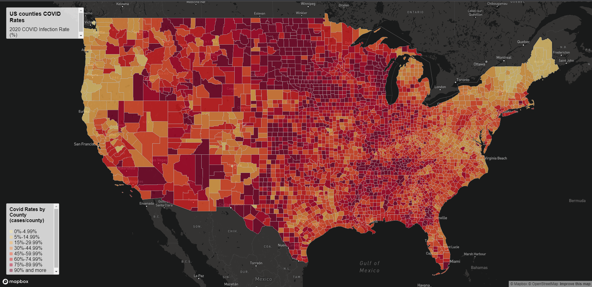
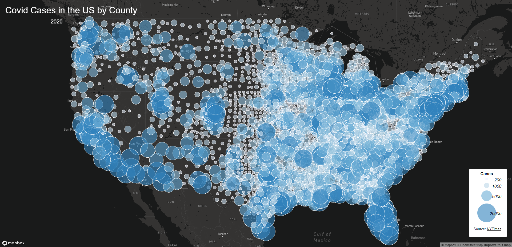

# Web Map Application

## Choropleth Map

[https://rwhite02.github.io/Mapping-Covid-Cases-and-Rates/map1.html] is a choropleth map that shows each US county's COVID infection rate. This map is interactive by utilizing JavaScript so that when you hover your mouse over a certain county, it will show that county's infection rate. This map is ideal for looking into the infection rates within each county, since the infection rate value is directly accessible due to the interactive aspect using JavaScript. HTML and CSS were used to choose color schemes, map size, and text boxes. JavaScript was also used to load the mapbox basemap. The population data for calculating the case rates are from the 2018 ACS 5 year estimates.

## Proportional Symbol Map

[map2.html] is a proportional symbol map that shows the number of COVID cases in each US county. Each county has a bubble around it and the cases number will dictate the size and color of that bubble. Counties with higher case numbers will be larger and a darker color, and counties with lower case numbers will be smaller and lighter. Although you can click on a certain county and see its case numbers, it's not ideal for exact numbers like the choropleth map because of how cluttered some regions can be. Similar to the choropleth map, HTML and CSS were used to generate color schemes, text boxes, and map size. JavaScript was also used to load the mapbox basemap. The data used in this map is from New York Times.

[map1.html]: https://rwhite02.github.io/Web-Map-Application/map1.html
[map2.html]: https://rwhite02.github.io/Web-Map-Application/map2.html
